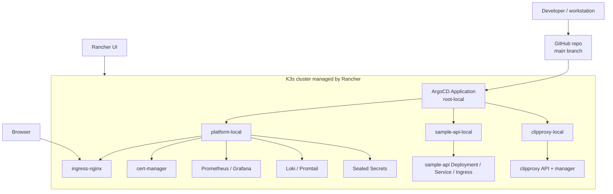

# Architecture report: Rancher, K3s, ArgoCD, GitOps và clipproxy

Repo này là template học DevOps/Kubernetes cho Rancher, K3s, ArgoCD và GitOps. Tài liệu này viết cho người mới tiếp xúc với Kubernetes: đọc từ mental model trước, sau đó mới đi vào manifest, luồng deploy, runtime request và cách debug.

Đây là tài liệu kiến trúc cho **lab học tập**. Nó không phải script tự động cài đặt toàn bộ môi trường. Mục tiêu là giúp bạn hiểu từng lớp trước khi tự sửa manifest hoặc xử lý lỗi trong cluster.

## 1. Executive summary

Repo này mô phỏng một platform Kubernetes local:

- **Git** chứa desired state: cấu hình mong muốn của cluster nằm trong repo.
- **ArgoCD** đọc Git và đồng bộ cluster.
- **Kubernetes/K3s** chạy workload thật.
- **Rancher** giúp quan sát và quản trị cluster bằng UI.
- **Ingress** đưa request từ browser vào service trong cluster.
- **sample-api** là app mẫu nhỏ để học pipeline và GitOps.
- **clipproxy** là app mới được deploy bằng ArgoCD, có manager UI và API backend riêng.

Luồng quan trọng nhất:

```text
Developer -> Git push -> ArgoCD sync -> Kubernetes resources -> Pod chạy app -> Người dùng truy cập qua Ingress
```

Nếu bạn chỉ nhớ một câu: **đừng sửa tay trong cluster trước; hãy sửa Git, push, để ArgoCD sync, rồi dùng Rancher hoặc kubectl để quan sát kết quả.**

## 2. Mental model cho người mới Kubernetes

- **Git is the source of truth**: trạng thái mong muốn của cluster nằm trong repo, chủ yếu ở `gitops/`.
- **ArgoCD là robot đồng bộ**: ArgoCD so sánh Git với cluster rồi tạo/sửa/xóa resource để cluster giống Git.
- **Kubernetes là runtime**: Kubernetes nhận manifest và chạy Pod, Service, Ingress, PVC, Secret, ConfigMap.
- **Rancher là lớp quan sát và quản trị**: Rancher giúp nhìn cluster, workload, namespace, event, log và trạng thái tài nguyên qua UI.

So sánh dễ hiểu:

| Khái niệm | Nghĩa đơn giản | Trong repo này |
| --- | --- | --- |
| Git | Bản thiết kế mong muốn | `gitops/` |
| ArgoCD | Người thợ tự động áp bản thiết kế | `root-local`, `platform-local`, `sample-api-local`, `clipproxy-local` |
| Kubernetes/K3s | Công trường chạy hệ thống | cluster local |
| Rancher | Bảng điều khiển và camera quan sát | Rancher UI |
| Ingress | Cổng vào từ browser | `sample-api.local`, `clipproxy.local` |

Người mới thường nhầm giữa **sync thành công** và **app chạy tốt**. ArgoCD `Synced` chỉ nói rằng manifest đã được apply đúng theo Git. App vẫn có thể `Degraded` nếu Pod bị `CrashLoopBackOff`, PVC `Pending`, image pull lỗi, hoặc readiness probe fail.

## 3. Repository map

```text
repo root
├── apps/                  # source code app mẫu
├── clipproxy/             # config tham khảo cho clipproxy
├── ci/                    # CI pipeline mẫu
├── gitops/                # Kubernetes desired state
├── infra/                 # Rancher/K3s/local services
├── docs/                  # tài liệu học và architecture report
├── operations/            # checklist/runbook vận hành
├── tests/                 # regression tests cho manifests/docs/config
└── bin/                   # script hỗ trợ lab
```

Các thư mục quan trọng nhất khi học Kubernetes trong repo này:

| Thư mục | Vai trò | Người mới nên hiểu gì |
| --- | --- | --- |
| `gitops/bootstrap/argocd/` | cài và cấu hình ArgoCD ban đầu | nơi có root app |
| `gitops/clusters/local/` | entrypoint GitOps cho cluster local | app-of-apps bắt đầu ở đây |
| `gitops/platform/` | platform components | ingress, cert-manager, observability, logging, secrets |
| `gitops/apps/sample-api/` | manifests cho sample app | base/overlay, Deployment, Service, Ingress |
| `gitops/apps/clipproxy/` | manifests cho clipproxy | API, manager, PVC, ConfigMap, Secret reference |
| `docs/clipproxy-rancher-deploy.md` | hướng dẫn deploy clipproxy | các bước kiểm tra sau khi sync |

## 4. Cluster và GitOps architecture

### 4.1 Sơ đồ tổng quan



### 4.2 App-of-apps là gì?

App-of-apps nghĩa là một ArgoCD Application cha tạo ra các Application con.

Trong repo này:

```text
root-local
├── platform-local
├── sample-api-local
└── clipproxy-local
```

- `root-local` trỏ vào `gitops/clusters/local/`.
- `gitops/clusters/local/kustomization.yaml` liệt kê `platform.yaml`, `sample-api.yaml`, `clipproxy.yaml`.
- Mỗi file đó tạo một ArgoCD Application con.
- Application con trỏ đến manifests cụ thể trong `gitops/platform/` hoặc `gitops/apps/*/overlays/local`.

Điều này giúp bạn thêm app mới bằng cách thêm một file Application và include nó trong kustomization, thay vì apply thủ công nhiều file YAML.

## 5. GitOps deployment flow

### 5.1 Luồng deploy khi bạn push Git

```text
1. Bạn sửa manifest trong repo.
2. Bạn commit và push lên branch ArgoCD đang watch, hiện là main.
3. root-local thấy commit mới.
4. root-local sync gitops/clusters/local/.
5. ArgoCD tạo hoặc cập nhật app con như clipproxy-local.
6. clipproxy-local sync gitops/apps/clipproxy/overlays/local.
7. Kubernetes tạo Namespace, ConfigMap, PVC, Deployment, Service, Ingress.
8. Pod chạy container.
9. Service cấp DNS/ClusterIP nội bộ.
10. Ingress expose host ra browser.
```

### 5.2 Khi nào `kubectl get application` báo NotFound?

Ví dụ:

```bash
kubectl -n argocd get application clipproxy-local
```

Nếu trả về `NotFound`, thường là một trong các nguyên nhân:

- commit chưa được push lên remote mà ArgoCD watch,
- `root-local` chưa sync tới commit mới,
- `gitops/clusters/local/kustomization.yaml` chưa include `clipproxy.yaml`,
- ArgoCD đang lỗi repo access hoặc target revision.

Khi app xuất hiện và `Synced`, nghĩa là GitOps wiring đã chạy. Nếu sau đó app `Degraded`, chuyển sang debug workload trong namespace của app.

## 6. Runtime request flow

Kubernetes runtime khác với GitOps flow. GitOps là cách tạo resource; runtime là cách request thật đi qua hệ thống.

### 6.1 Pattern chung: Ingress -> Service -> Pod

```text
Browser -> Ingress -> Service -> Pod
```

Hoặc viết ngắn gọn:

```text
Ingress -> Service -> Pod
```

Ý nghĩa:

- **Ingress** nhận HTTP request theo hostname/path.
- **Service** chọn Pod thông qua label selector.
- **Pod** chạy container thật.

### 6.2 Request vào sample-api

```text
sample-api.local -> Ingress -> sample-api Service -> sample-api Pod
```

### 6.3 Request vào clipproxy

```text
clipproxy.local -> Ingress -> clipproxy-manager Service -> clipproxy-manager Pod
```

Sau khi vào manager, manager gọi API nội bộ:

```text
clipproxy-manager Pod -> clipproxy-api Service -> clipproxy-api Pod
```

External URL dự kiến:

```text
http://clipproxy.local
```

Nếu chưa cấu hình DNS/hosts, có thể test tạm bằng port-forward:

```bash
kubectl -n clipproxy port-forward svc/clipproxy-manager 18317:18317
```

Rồi mở:

```text
http://localhost:18317
```

## 7. Kubernetes object glossary bằng ví dụ trong repo

| Object | Hiểu đơn giản | Ví dụ trong repo | Khi lỗi thì xem gì |
| --- | --- | --- | --- |
| Namespace | Phòng riêng trong cluster | `sample-api`, `clipproxy`, `argocd` | `kubectl get ns` |
| Deployment | Bộ điều khiển tạo/rollout Pod | `clipproxy-api`, `clipproxy-manager` | `kubectl -n clipproxy rollout status deploy/clipproxy-api` |
| Pod | Nơi container chạy thật | `clipproxy-api-...` | `kubectl -n clipproxy describe pod ...` |
| Service | Địa chỉ ổn định để gọi Pod | `clipproxy-manager` port `18317` | `kubectl -n clipproxy get svc` |
| Ingress | Route HTTP từ ngoài cluster vào Service | host `clipproxy.local` | `kubectl -n clipproxy get ingress` |
| ConfigMap | Config không nhạy cảm | `clipproxy-config` chứa `config.yaml` | kiểm tra manifest, không chứa secret thật |
| Secret | Config nhạy cảm | `clipproxy-secret` | chỉ kiểm tra object tồn tại, không in value |
| PersistentVolumeClaim | Yêu cầu ổ đĩa bền vững | `clipproxy-api-data`, `clipproxy-manager-data` | `kubectl -n clipproxy describe pvc ...` |
| ArgoCD Application | Resource bảo ArgoCD sync path nào | `clipproxy-local` | `kubectl -n argocd get application clipproxy-local` |

Tên đầy đủ của PVC là **PersistentVolumeClaim**. Người mới hay nhầm PVC với volume thật. PVC là yêu cầu; Kubernetes/storage class sẽ cấp PV thật phía sau.

## 8. Platform components

Platform layer nằm trong `gitops/platform/`.

| Module | Vai trò | Ghi chú cho người mới |
| --- | --- | --- |
| `00-namespaces` | tạo namespace | namespace nên có trước workload |
| `10-ingress` | cài ingress-nginx | cần trước khi Ingress route được traffic |
| `20-cert-manager` | quản lý certificate | cần CRD riêng |
| `30-observability` | Prometheus/Grafana | dùng để xem metrics |
| `40-logging` | Loki/Promtail | dùng để gom log |
| `50-secrets` | Sealed Secrets | commit secret dạng encrypted, không commit plain text |
| `60-backup` | Velero | backup/restore resources |
| `70-registry` | registry notes | phục vụ image lab |
| `80-policy` | Kyverno | policy/security guardrails |

Thứ tự số giúp người mới thấy dependency. Ví dụ Ingress route cần ingress controller; ServiceMonitor cần Prometheus Operator CRD; SealedSecret cần controller Sealed Secrets.

## 9. Kiến trúc ứng dụng: sample-api và clipproxy

### 9.1 sample-api

`sample-api` là app Flask mẫu. Nó giúp học các khái niệm cơ bản:

- Deployment chạy container app.
- Service expose app trong cluster.
- Ingress expose app qua `sample-api.local`.
- ServiceMonitor cho Prometheus scrape `/metrics`.
- NetworkPolicy giới hạn traffic.
- Secret demo được mount vào env var optional.

### 9.2 clipproxy

`clipproxy` có hai workload:

| Thành phần | Image | Vai trò | Expose |
| --- | --- | --- | --- |
| `clipproxy-api` | `eceasy/cli-proxy-api:latest` | backend proxy API | nội bộ qua Service `clipproxy-api:8317` |
| `clipproxy-manager` | `seakee/cpa-manager-plus:latest` | manager UI/API | qua Ingress `clipproxy.local` |

Các resource quan trọng:

- `clipproxy-config`: ConfigMap mount vào `/CLIProxyAPI/config.yaml` cho `clipproxy-api`.
- `clipproxy-secret`: Secret chứa `CPA_MANAGER_ADMIN_KEY` và `CPA_MANAGEMENT_KEY` cho manager.
- `clipproxy-api-data`: PersistentVolumeClaim cho dữ liệu API ở `/root/.cli-proxy-api`.
- `clipproxy-manager-data`: PersistentVolumeClaim cho manager ở `/data`.
- `clipproxy-manager`: Service nội bộ port `18317`.
- `clipproxy-api`: Service nội bộ port `8317`.
- `clipproxy`: Ingress host `clipproxy.local` route tới manager.

Luồng runtime:

```text
Browser
  -> http://clipproxy.local
  -> Ingress clipproxy
  -> Service clipproxy-manager:18317
  -> Pod clipproxy-manager
  -> Service clipproxy-api:8317
  -> Pod clipproxy-api
```

Điểm quan trọng: chỉ manager được expose ra ngoài. API được giữ nội bộ để giảm bề mặt truy cập public.

### 9.3 Vì sao clipproxy có thể Synced nhưng Degraded?

ArgoCD `Synced` nghĩa là manifest trong Git đã được apply. `Degraded` nghĩa là một hoặc nhiều resource chạy không khỏe.

Ví dụ thực tế với `clipproxy-api`:

```text
CrashLoopBackOff
proxy service exited with error: cliproxy: failed to create watcher: too many open files
```

Đây là lỗi runtime trên node/container, không phải lỗi GitOps. App cần tạo file watcher nhưng giới hạn inotify/file watcher trên node quá thấp. Cách debug là xem pod và log, không sửa bừa ArgoCD Application.

Lệnh đọc log an toàn:

```bash
kubectl -n clipproxy logs deploy/clipproxy-api --tail=50
```

Lệnh kiểm tra giới hạn node:

```bash
sysctl fs.inotify.max_user_instances fs.inotify.max_user_watches
```

## 10. Troubleshooting map cho người mới

| Triệu chứng | Lớp đang lỗi | Lệnh đọc trạng thái | Hướng nghĩ |
| --- | --- | --- | --- |
| `clipproxy-local` `NotFound` | ArgoCD app-of-apps | `kubectl -n argocd get applications` | root app chưa sync hoặc Git chưa có manifest |
| App `Synced` nhưng `Degraded` | workload runtime | `kubectl -n clipproxy get pods` | manifest đã apply, Pod/Deployment/PVC đang lỗi |
| Pod `CrashLoopBackOff` | container/app | `kubectl -n clipproxy logs deploy/clipproxy-api --tail=50` | app start rồi crash, đọc log container |
| Pod `Pending` | scheduling/storage | `kubectl -n clipproxy describe pod <pod-name>` | thiếu resource, PVC chưa bind, node không phù hợp |
| PVC `Pending` | storage class | `kubectl -n clipproxy describe pvc clipproxy-api-data` | provisioner chưa cấp volume |
| Ingress không vào được | networking/DNS | `kubectl -n clipproxy get ingress` | host chưa trỏ đúng ingress controller |
| Secret thiếu | config nhạy cảm | `kubectl -n clipproxy get secret clipproxy-secret` | tạo secret, không in secret value |
| `too many open files` | node/kernel limit | `sysctl fs.inotify.max_user_instances fs.inotify.max_user_watches` | tăng inotify limit trên node |

Quy tắc debug:

1. App có tồn tại trong ArgoCD chưa?
2. App có `Synced` không?
3. Nếu `Synced` nhưng không `Healthy`, xem resource con.
4. Nếu Pod lỗi, xem `describe pod` và `logs`.
5. Nếu Ingress lỗi, kiểm tra hosts/DNS và ingress controller.

## 11. Read-only command cheat sheet

Các lệnh dưới đây chỉ đọc trạng thái hoặc log, không in secret value.

### ArgoCD

```bash
kubectl -n argocd get applications
kubectl -n argocd get application root-local
kubectl -n argocd get application clipproxy-local
kubectl -n argocd describe application clipproxy-local
```

### clipproxy

```bash
kubectl -n clipproxy get pods,svc,ingress,pvc
kubectl -n clipproxy get secret clipproxy-secret
kubectl -n clipproxy rollout status deploy/clipproxy-api
kubectl -n clipproxy rollout status deploy/clipproxy-manager
kubectl -n clipproxy logs deploy/clipproxy-api --tail=50
kubectl -n clipproxy logs deploy/clipproxy-manager --tail=50
```

### Ingress

```bash
kubectl -n ingress-nginx get pods,svc
kubectl get ingress -A
```

### Storage

```bash
kubectl get storageclass
kubectl -n clipproxy describe pvc clipproxy-api-data
kubectl -n clipproxy describe pvc clipproxy-manager-data
```

### Node limits cho lỗi watcher

```bash
sysctl fs.inotify.max_user_instances fs.inotify.max_user_watches
```

## 12. Cách đọc repo theo thứ tự

Nếu bạn mới tiếp xúc Kubernetes, đọc theo thứ tự này:

1. `docs/architecture.md` để hiểu bức tranh lớn.
2. `docs/learning-path.md` để biết lộ trình học.
3. `infra/k3s/README.md` để hiểu cluster local.
4. `gitops/bootstrap/argocd/install.md` để hiểu ArgoCD bootstrap.
5. `gitops/clusters/local/kustomization.yaml` để thấy app-of-apps entrypoint.
6. `gitops/clusters/local/clipproxy.yaml` để thấy ArgoCD Application của clipproxy.
7. `gitops/apps/clipproxy/base/` để đọc Deployment, Service, Ingress, PVC, ConfigMap.
8. `docs/clipproxy-rancher-deploy.md` để chạy và debug clipproxy.

## 13. Local lab so với môi trường thật

Repo này ưu tiên học trên local nên có một số giả định:

- K3s chạy trên máy local.
- Rancher dùng để quan sát/quản trị.
- Ingress host có thể dùng `.local` và `/etc/hosts`.
- Storage dùng `local-path`.
- Secret có thể tạo thủ công cho lab, sau đó nâng cấp lên Sealed Secrets.

Khi chuyển sang môi trường thật, cần cân nhắc:

- domain thật và TLS thật,
- storage class ổn định hơn,
- secret manager hoặc sealed secret quy trình chặt chẽ,
- tách app repo và GitOps repo,
- monitoring/alerting/backup đầy đủ.

## 14. Tóm tắt

Có thể hiểu repo này theo 5 lớp:

1. **Source/app layer**: `apps/sample-api/`, `clipproxy/`.
2. **GitOps layer**: `gitops/` là desired state.
3. **Delivery layer**: CI build image và cập nhật Git.
4. **Runtime layer**: K3s/Kubernetes chạy Pod, Service, Ingress, PVC.
5. **Management/learning layer**: Rancher UI, docs, tests, operations runbooks.

Khi debug, luôn xác định lỗi nằm ở lớp nào. `NotFound` của ArgoCD Application là lỗi GitOps/app-of-apps. `Synced` nhưng `Degraded` thường là lỗi runtime. `CrashLoopBackOff` phải đọc log Pod. Ingress không vào được thì kiểm tra DNS/hosts, ingress controller và backend Service.
