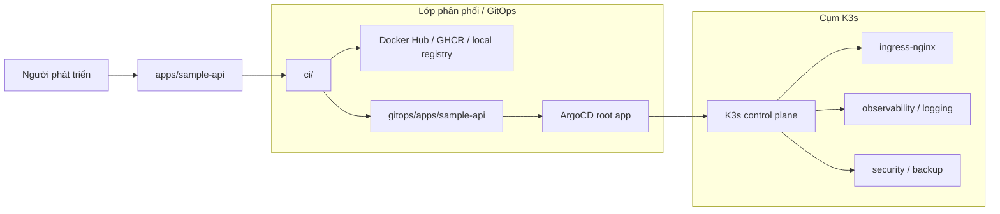
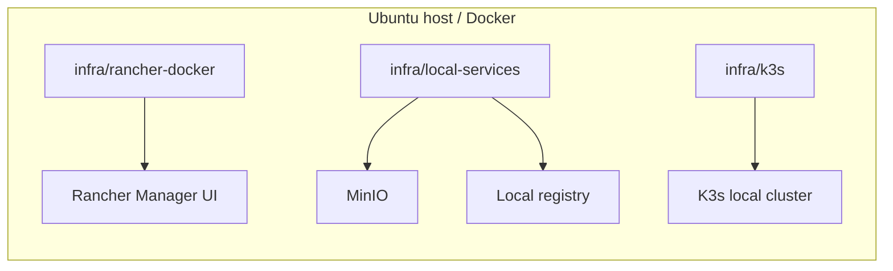
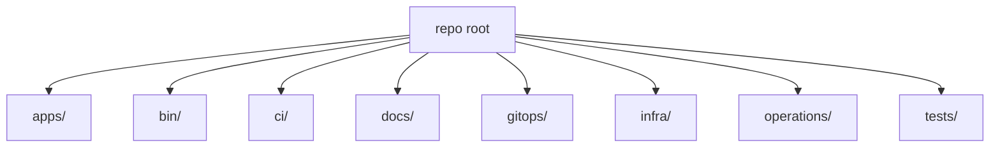
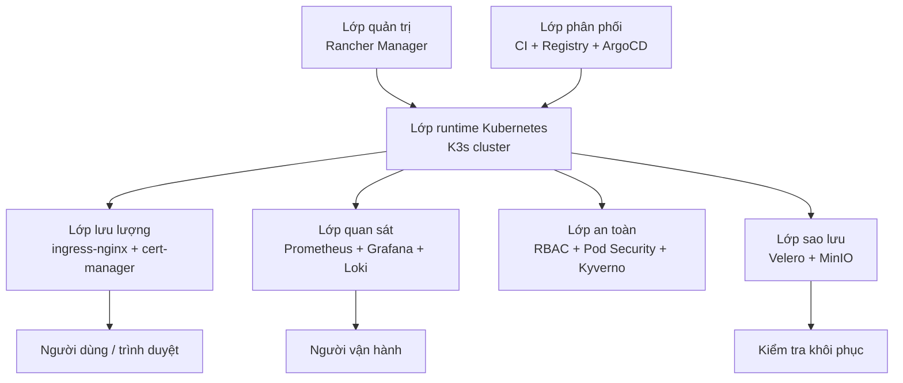
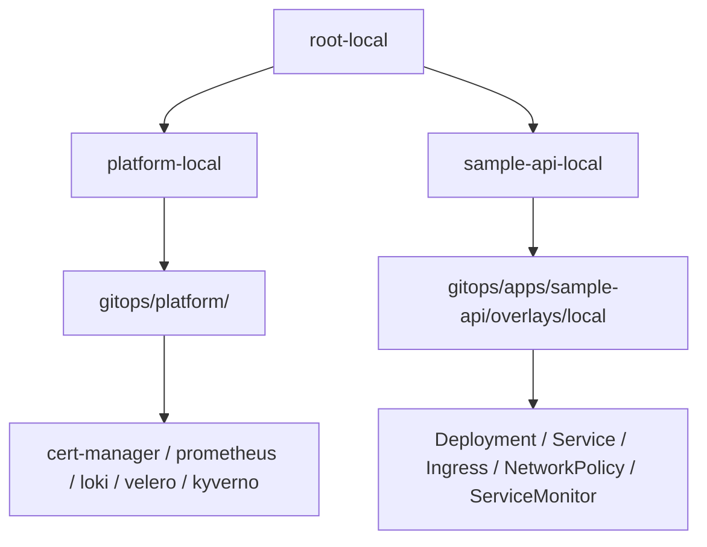
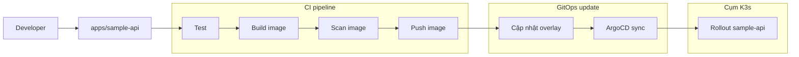

# Kiến trúc và hướng dẫn module

Repo này là template học DevOps/Kubernetes cho Rancher, K3s, ArgoCD và GitOps. Tài liệu này giải thích kiến trúc tổng thể, vai trò của từng thư mục, luồng đi từ mã nguồn đến cluster, và thứ tự nên đọc nếu bạn mới bắt đầu.

Đây là tài liệu kiến trúc cho **lab học tập**. Nó không phải script tự động cài đặt toàn bộ môi trường. Mục tiêu của repo là đi từng phase, xác minh từng bước, rồi mới chuyển sang phase tiếp theo để dễ debug và dễ hiểu.

## Mục tiêu của tài liệu

- Hiểu tổng quan hệ thống hoạt động như thế nào.
- Biết từng thư mục phụ trách phần nào.
- Biết luồng đi từ mã nguồn đến image, GitOps, ArgoCD và cluster.
- Biết vì sao repo chia theo phase thay vì cài một lần tất cả.
- Biết đọc tài liệu nào trước nếu mới học repo này.
- Biết các điểm dễ lỗi nhất khi sync ArgoCD hoặc chạy lab local.

## Mục lục

1. Tổng quan
2. Kiến trúc mục tiêu
3. Cấu trúc thư mục chính
4. Bảng module tổng hợp
5. Giải thích từng module
6. Các lớp kiến trúc theo chức năng
7. Luồng bootstrap ArgoCD và thứ tự phase
8. Luồng CI/CD và GitOps
9. Phụ thuộc CRD và thứ tự triển khai
10. Điểm dễ lỗi và cách debug
11. Cách học repo theo thứ tự
12. Chiến lược mở rộng và môi trường
13. Tóm tắt

## 1. Tổng quan

### 1.1 Bức tranh chung

Repo này ghép nhiều phần lại thành một lab hoàn chỉnh:

- **Ứng dụng mẫu** ở `apps/sample-api/`
- **GitOps/Kubernetes manifests** ở `gitops/`
- **Hạ tầng local** ở `infra/`
- **Pipeline CI/CD** ở `ci/`
- **Script hỗ trợ** ở `bin/`
- **Tài liệu học tập và kiến trúc** ở `docs/`
- **Checklist và runbook vận hành** ở `operations/`
- **Test regression cho cấu hình** ở `tests/`

Nếu nhìn theo cách đơn giản nhất, luồng chính là:

```text
Mã nguồn -> Test -> Build image -> Scan image -> Push registry -> Cập nhật GitOps -> ArgoCD sync -> Kubernetes rollout
```

### 1.2 Tài liệu liên quan nên đọc cùng

- [README.md](../README.md): tổng quan repo và lộ trình học khuyên dùng.
- [docs/learning-path.md](learning-path.md): lộ trình học theo khái niệm.
- [docs/deployment-roadmap.md](deployment-roadmap.md): roadmap triển khai theo phase.
- [tutorial-phase-0-3.md](tutorial-phase-0-3.md): tutorial chạy lab theo từng phase, hiện đã mở rộng đến Phase 10.

### 1.3 Nguyên tắc kiến trúc của repo

- Chia theo **trách nhiệm**, không gộp tất cả vào một chỗ.
- Mỗi lớp phải có thể hiểu và debug độc lập.
- Mỗi phase chỉ nên thêm đúng phần cần cho phase đó.
- Phụ thuộc phải rõ ràng: cái nào tạo CRD thì phải có trước, cái nào dùng CRD thì sync sau.
- Các file cấu hình phải đủ nhỏ để đọc bằng mắt, không cần suy luận quá nhiều.

## 2. Kiến trúc mục tiêu

### 2.1 Sơ đồ tổng quan



### 2.2 Môi trường local đi kèm



### 2.3 Ý nghĩa của kiến trúc này

- **Rancher** là lớp quản trị cụm.
- **K3s** là runtime chạy workload.
- **ArgoCD** là lớp GitOps để đồng bộ trạng thái mong muốn.
- **ingress-nginx**, **cert-manager**, **Prometheus/Grafana**, **Loki**, **Sealed Secrets**, **Velero**, **Kyverno** là các năng lực nền tảng của platform.
- **sample-api** là workload mẫu để kiểm tra toàn bộ chuỗi từ code đến cluster.

Thiết kế này giúp bạn học từng phần riêng lẻ, nhưng vẫn thấy được cách các phần ghép lại thành hệ thống hoàn chỉnh.

## 3. Cấu trúc thư mục chính



### 3.1 Ý nghĩa ngắn gọn

- `apps/`: ứng dụng mẫu và các tài nguyên chạy cùng ứng dụng.
- `gitops/`: trạng thái mong muốn của Kubernetes.
- `infra/`: môi trường local, Docker Compose, Rancher, K3s, registry, MinIO.
- `ci/`: pipeline build/test/scan/push và cập nhật GitOps.
- `bin/`: script hỗ trợ dùng lại khi làm lab.
- `docs/`: tài liệu học và tài liệu kiến trúc.
- `operations/`: checklist và runbook vận hành.
- `tests/`: test regression cho các file cấu hình quan trọng.

## 4. Bảng module tổng hợp

| Thư mục | Vai trò | File chính | Phụ thuộc/chú ý |
| --- | --- | --- | --- |
| `apps/sample-api/` | Ứng dụng Flask mẫu để kiểm tra toàn bộ platform | `apps/sample-api/src/app.py`, `apps/sample-api/Dockerfile`, `apps/sample-api/tests/test_app.py` | Được CI build và GitOps deploy |
| `gitops/` | Khai báo desired state cho cluster | `gitops/bootstrap/argocd/root-local.yaml`, `gitops/clusters/local/*`, `gitops/platform/*` | Phụ thuộc CRD và thứ tự sync |
| `infra/` | Môi trường local cho lab | `infra/rancher-docker/`, `infra/local-services/`, `infra/k3s/` | Cần Docker và host local |
| `ci/` | Test/build/scan/push image và cập nhật GitOps | `ci/github/sample-api-ci.yaml`, `ci/gitlab/sample-api-ci.yml` | Liên kết với image và overlay của `sample-api` |
| `bin/` | Lệnh hỗ trợ cho workflow local | `bin/check-host.sh`, `bin/render-gitops.sh`, `bin/build-local-sample-api.sh` | Được root `Makefile` gọi lại |
| `docs/` | Tài liệu học theo phase và kiến trúc | `docs/learning-path.md`, `docs/deployment-roadmap.md`, `docs/architecture.md`, `tutorial-phase-0-3.md` | Nên đọc đầu tiên nếu mới vào repo |
| `operations/` | Checklist và runbook vận hành | `operations/checklists/platform-readiness.md`, `operations/runbooks/*` | Dùng khi triển khai hoặc xử lý sự cố |
| `tests/` | Regression test cho cấu hình repo | `tests/test_sample_api_image_registry.py` | Bảo vệ sự nhất quán giữa script, workflow và manifest |
| root `Makefile` | Shortcut cho các lệnh chính | `Makefile` | Gọi `bin/` và `apps/sample-api/` |

## 5. Giải thích từng module

### 5.1 `apps/sample-api/`

Đây là ứng dụng mẫu chính của repo. Mục đích của nó không phải phục vụ business, mà là tạo một workload nhỏ, rõ ràng, để kiểm tra toàn bộ platform từ container tới ingress, metrics, logging và policy.

Các thành phần chính:

- [apps/sample-api/src/app.py](../apps/sample-api/src/app.py): ứng dụng Flask với 3 endpoint
  - `/`: trả về `service` và `status`
  - `/healthz`: dùng cho readiness/liveness probe
  - `/metrics`: trả về metrics mẫu cho Prometheus
- [apps/sample-api/Dockerfile](../apps/sample-api/Dockerfile): đóng gói app thành image Python 3.12 slim
- [apps/sample-api/requirements.txt](../apps/sample-api/requirements.txt): phụ thuộc tối thiểu, chỉ có Flask và pytest
- [apps/sample-api/tests/test_app.py](../apps/sample-api/tests/test_app.py): test `/healthz`

Ý nghĩa của module này:

- Nếu app chạy được, bạn biết container và service layer đã ổn cơ bản.
- Nếu ingress hoạt động, bạn truy cập được app qua host name.
- Nếu metrics và log hoạt động, bạn biết observability đã nối đúng.
- Nếu probe fail, bạn biết vấn đề nằm ở application hoặc deployment manifest.

### 5.2 `gitops/`

Đây là trung tâm của repo. Mọi thứ trong `gitops/` mô tả trạng thái mong muốn của cluster bằng Kubernetes manifests và Kustomize.

Có 3 lớp chính:

#### Bootstrap

- [gitops/bootstrap/argocd/install.md](../gitops/bootstrap/argocd/install.md): giải thích cách cài ArgoCD ban đầu.
- [gitops/bootstrap/argocd/root-local.yaml](../gitops/bootstrap/argocd/root-local.yaml): root Application đầu tiên.

Root app này trỏ về [gitops/clusters/local/](../gitops/clusters/local/) để ArgoCD quản lý tiếp các app con.

#### Cluster layer

- [gitops/clusters/local/kustomization.yaml](../gitops/clusters/local/kustomization.yaml): ghép `platform.yaml` và `sample-api.yaml`.
- [gitops/clusters/local/platform.yaml](../gitops/clusters/local/platform.yaml): triển khai các component platform.
- [gitops/clusters/local/sample-api.yaml](../gitops/clusters/local/sample-api.yaml): triển khai ứng dụng mẫu.

Đây là mô hình **app-of-apps**: cluster root chỉ biết các app cấp cao, còn ArgoCD sẽ tự sync các resource bên trong.

#### Platform layer

[gitops/platform/kustomization.yaml](../gitops/platform/kustomization.yaml) gom các module platform theo thứ tự số:

- `00-namespaces`: tạo namespace riêng, trong đó `sample-api` có label Pod Security.
- `10-ingress`: cài `ingress-nginx`.
- `20-cert-manager`: cài `cert-manager`.
- `30-observability`: cài `kube-prometheus-stack`.
- `40-logging`: cài `loki` và `promtail`.
- `50-secrets`: cài `sealed-secrets`.
- `60-backup`: cài `velero`.
- `70-registry`: ghi chú về registry dùng trong lab.
- `80-policy`: cài `kyverno` và policy `require-run-as-non-root`.

Cách chia theo số thứ tự giúp repo dễ đọc và dễ debug. Bạn có thể thêm hoặc bớt từng lớp mà không cần đảo toàn bộ hệ thống.

#### App layer

[gitops/apps/sample-api/base/](../gitops/apps/sample-api/base/) mô tả app ở mức Kubernetes cơ bản:

- Deployment: tạo Pod chạy container `sample-api`, cấu hình probe, resource và security context.
- Service: tạo ClusterIP để các thành phần trong cluster gọi app qua port 80.
- Ingress: expose app ra host `sample-api.local`.
- ServiceMonitor: để Prometheus scrape endpoint `/metrics`.
- NetworkPolicy: chỉ cho traffic từ namespace `ingress-nginx` vào app.

[gitops/apps/sample-api/overlays/local/kustomization.yaml](../gitops/apps/sample-api/overlays/local/kustomization.yaml) là overlay cho local lab. Overlay này đổi image từ `localhost:5000/sample-api` sang `nghiadvbka/sample-api:local`.

Ý nghĩa của cách làm này:

- `base` giữ phần chung, không phụ thuộc môi trường.
- `overlay` giữ phần riêng cho local/dev.
- CI có thể cập nhật overlay mà không phải sửa manifest base.

### 5.3 `infra/`

`infra/` chứa các hướng dẫn để chuẩn bị môi trường chạy lab.

Có 3 phần quan trọng:

- [infra/rancher-docker/](../infra/rancher-docker/): chạy Rancher Manager bằng Docker cho lab/dev local.
- [infra/local-services/](../infra/local-services/): chạy MinIO và registry local bằng Docker Compose.
- [infra/k3s/](../infra/k3s/): cài K3s local và import cluster vào Rancher.

Đây là lớp nền tảng của repo. Nếu lớp này có vấn đề, các lớp bên trên sẽ khó debug hơn rất nhiều.

### 5.4 `ci/`

`ci/` cho bạn thấy cùng một workflow có thể triển khai trên nhiều CI provider.

Có 2 mẫu chính:

- [ci/github/sample-api-ci.yaml](../ci/github/sample-api-ci.yaml)
- [ci/gitlab/sample-api-ci.yml](../ci/gitlab/sample-api-ci.yml)

Ý tưởng chung:

1. chạy test cho app
2. build Docker image
3. scan image bằng Trivy
4. push image lên registry
5. cập nhật GitOps overlay nếu pipeline hỗ trợ bước đó

Riêng GitHub Actions có thêm bước `kustomize edit set image` để cập nhật overlay GitOps sau khi image mới đã được build và push. GitLab CI trong repo hiện là mẫu test/build/scan/push image, chưa có bước commit ngược lại vào GitOps manifest.

### 5.5 `bin/`

`bin/` chứa các script nhỏ để chạy nhanh các thao tác lặp đi lặp lại.

Các script chính:

- [bin/check-host.sh](../bin/check-host.sh): kiểm tra RAM, disk, tools, Docker, kubectl và context.
- [bin/render-gitops.sh](../bin/render-gitops.sh): render Kustomize của cluster/platform/sample-api ra file tạm.
- [bin/build-local-sample-api.sh](../bin/build-local-sample-api.sh): build và push image `sample-api`.

Root [Makefile](../Makefile) biểu diễn các script này thành lệnh ngắn gọn:

- `make check`
- `make render`
- `make test-sample`
- `make build-sample`

### 5.6 `docs/`

`docs/` giúp người học đi theo từng bước, không bị choáng.

Hai tài liệu nên đọc đầu tiên:

- [docs/learning-path.md](learning-path.md): trình tự học từ host readiness -> Rancher -> Kubernetes core -> GitOps -> observability -> CI/CD -> security/backup.
- [docs/deployment-roadmap.md](deployment-roadmap.md): roadmap để lên quy trình triển khai.
- [tutorial-phase-0-3.md](tutorial-phase-0-3.md): tutorial thực hành theo phase, hiện đã mở rộng đến Phase 10.

Tài liệu này chính là một bản đồ học. Nếu bạn mới bắt đầu, đây là nơi nên mở trước.

### 5.7 `operations/`

`operations/` chứa các tài liệu để vận hành và kiểm tra môi trường.

- [operations/checklists/platform-readiness.md](../operations/checklists/platform-readiness.md): checklist trước khi cài đặt.
- [operations/runbooks/](../operations/runbooks/): runbook cho các tình huống vận hành.

Thư mục này hữu ích khi bạn không còn chỉ học, mà đã bắt đầu làm lab hoặc xử lý rollback/restore.

### 5.8 `tests/`

`tests/` không test ứng dụng theo nghĩa thông thường, mà test sự đồng bộ giữa các file cấu hình quan trọng.

[tests/test_sample_api_image_registry.py](../tests/test_sample_api_image_registry.py) kiểm tra 3 điều:

- overlay local có rewrite image sang Docker Hub
- build script mặc định push đúng image name
- GitHub Actions dùng Docker Hub image và login đúng secret

Đây là một kiểu regression test rất hữu ích cho repo GitOps, vì nhiều lỗi không nằm trong code Python, mà nằm trong manifest, script hoặc workflow.

### 5.9 Root `Makefile`

Root [Makefile](../Makefile) là lớp tiện dụng cho người học:

- `make check` gọi `bin/check-host.sh`
- `make render` gọi `bin/render-gitops.sh`
- `make test-sample` chạy pytest cho sample-api
- `make build-sample` gọi script build image

Nếu làm lab thường xuyên, đây là nơi tiết kiệm thao tác rất nhiều.

## 6. Các lớp kiến trúc theo chức năng

Ngoài cách nhìn theo thư mục, còn có thể nhìn repo theo các lớp chức năng.



### 6.1 Lớp quản trị

- Rancher Manager chạy bằng Docker container.
- Rancher quản lý Kubernetes cluster qua agent.
- Người học dùng Rancher UI để quan sát cluster, workload, namespace, RBAC, log và event.

Vai trò: cung cấp UI quản lý cluster và giúp người mới nhìn thấy bên trong Kubernetes dễ hơn.

### 6.2 Lớp runtime Kubernetes

- K3s local cluster là nơi chạy platform components và application workloads.
- Traefik mặc định có thể tắt khi dùng `ingress-nginx`.
- Kubernetes API là điểm ArgoCD và các tool tương tác với cluster.

Vai trò: là runtime chính của toàn bộ lab.

### 6.3 Lớp phân phối

- CI nằm trong `ci/`.
- Registry có thể là Docker Hub, GHCR hoặc registry local.
- ArgoCD sync desired state từ `gitops/` vào cluster.
- Với lab local, ArgoCD có thể expose qua Ingress ở `argocd.justnghia.dev` hoặc `argocd.local`.
- Khi đặt sau ingress-nginx, ArgoCD server thường chạy `server.insecure=true` để ingress forward HTTP vào service.

Vai trò: đưa thay đổi từ Git vào Kubernetes theo cách có kiểm soát.

### 6.4 Lớp lưu lượng

- `ingress-nginx` nhận request từ bên ngoài cluster.
- `cert-manager` phụ trách certificate/TLS khi có cấu hình issuer phù hợp.
- Ingress của `sample-api` route host `sample-api.local` vào Service của app.

Vai trò: expose app và platform UI ra host/domain để truy cập.

### 6.5 Lớp quan sát

- `kube-prometheus-stack` gồm Prometheus, Grafana và Alertmanager.
- `ServiceMonitor` của `sample-api` giúp Prometheus scrape `/metrics`.
- `loki` lưu log.
- `promtail` thu log từ node/pod và đẩy về Loki.

Vai trò: giúp xem metrics, log, dashboard, alert và tình trạng rollout.

### 6.6 Lớp an toàn

- Namespace `sample-api` có Pod Security label mức `restricted`.
- Deployment của `sample-api` chạy non-root và drop Linux capabilities.
- NetworkPolicy chỉ cho traffic từ `ingress-nginx` vào app.
- Kyverno có policy `require-run-as-non-root` ở chế độ audit.
- Sealed Secrets là hướng để không commit secret dạng plain text.

Vai trò: tạo các hàng rào an toàn cơ bản cho lab.

### 6.7 Lớp sao lưu

- MinIO local có thể đóng vai trò S3-compatible storage.
- Velero backup Kubernetes resources và có thể dùng cho restore drill.
- Rancher Docker volume cần được bảo vệ riêng nếu muốn giữ cấu hình Rancher.

Vai trò: giảm rủi ro mất cấu hình lab và giúp học quy trình backup/restore.

## 7. Luồng bootstrap ArgoCD và thứ tự phase

### 7.1 Mô hình app-of-apps



`root-local` là Application gốc. Nó chỉ biết cluster layer trong [gitops/clusters/local/](../gitops/clusters/local/), còn `platform-local` và `sample-api-local` là hai app con.

Điểm quan trọng của mô hình này là: ArgoCD quản lý dần dần theo lớp, không cần áp tất cả resource vào một lần.

### 7.2 Vì sao phải đi theo thứ tự phase

Phase trong [docs/deployment-roadmap.md](deployment-roadmap.md) và [tutorial-phase-0-3.md](tutorial-phase-0-3.md) không phải trang trí. Nó phản ánh phụ thuộc thật sự của hệ thống.

Ví dụ:

- Phase 3 cài ArgoCD trước, vì ArgoCD là bộ điều phối GitOps.
- Phase 4 mới cài `ingress-nginx` và `cert-manager`.
- Phase 5 mới cài `kube-prometheus-stack`.
- Phase 6 mới cài Loki/Promtail.
- Phase 8 mới cài Sealed Secrets.
- Phase 9 mới cài Velero.
- Phase 10 mới cài Kyverno.

Nếu nhảy cóc phase, rất dễ gặp lỗi kiểu `CRD not found`, `Missing`, `OutOfSync`, hoặc resource bị tạo nhưng controller chưa có.

### 7.3 Các phụ thuộc CRD quan trọng

Đây là phần hay gây lỗi nhất khi mới sync ArgoCD:

| Resource | CRD/controller phải có trước | Thường nằm ở phase |
| --- | --- | --- |
| `ClusterIssuer` | `cert-manager` | Phase 4 |
| `ServiceMonitor` | `kube-prometheus-stack` / Prometheus Operator | Phase 5 |
| `ClusterPolicy` | `kyverno` | Phase 10 |
| `Schedule` | `velero` | Phase 9 |
| `Ingress` | `ingress-nginx` | Phase 4 |

Điều này giải thích vì sao đôi khi `platform-local` hoặc `sample-api-local` có thể hiện `OutOfSync / Missing` dù `root-local` đã `Synced / Healthy`. Nghĩa là root bootstrap đã ổn, nhưng resource con đang chờ controller hoặc CRD tương ứng.

### 7.4 Sync wave và thứ tự triển khai

Một số manifest trong repo đã có annotation `argocd.argoproj.io/sync-wave` để giúp ArgoCD đi theo thứ tự mong muốn. Tuy nhiên sync wave **không thể thay thế CRD**. Nói cách khác:

- sync wave giúp ArgoCD sắp xếp thứ tự,
- nhưng CRD hoặc controller vẫn phải tồn tại trước thì resource mới hợp lệ.

Nếu gặp lỗi kiểu:

```text
The Kubernetes API could not find cert-manager.io/ClusterIssuer
```

hoặc:

```text
The Kubernetes API could not find monitoring.coreos.com/ServiceMonitor
```

thì đây là dấu hiệu rõ ràng rằng thứ tự triển khai đang bị vượt qua phụ thuộc.

## 8. Luồng CI/CD và GitOps



### 8.1 Ý tưởng của workflow

1. Nhà phát triển sửa `apps/sample-api/`.
2. CI chạy test cho ứng dụng.
3. CI build Docker image.
4. CI scan image bằng Trivy.
5. CI push image lên registry.
6. Nếu là GitHub Actions, workflow cập nhật overlay GitOps bằng `kustomize edit set image`.
7. ArgoCD thấy Git thay đổi và sync vào cluster.
8. Kubernetes rollout phiên bản mới.

### 8.2 Hai mẫu CI trong repo

- [ci/github/sample-api-ci.yaml](../ci/github/sample-api-ci.yaml)
- [ci/gitlab/sample-api-ci.yml](../ci/gitlab/sample-api-ci.yml)

GitHub Actions trong repo hiện đi khá sát flow end-to-end. GitLab CI là mẫu gần hơn cho test/build/scan/push image và có thể mở rộng thêm bước cập nhật GitOps nếu cần.

### 8.3 Vai trò của test regression trong `tests/`

[tests/test_sample_api_image_registry.py](../tests/test_sample_api_image_registry.py) bảo vệ 3 điểm dễ lệch nhất:

- overlay local trỏ đúng image registry,
- build script đẩy đúng image name mặc định,
- workflow CI login và update image nhất quán.

Điều này đặc biệt quan trọng trong GitOps, vì lỗi thường không nằm ở Python code, mà nằm ở tên image, overlay hoặc workflow.

### 8.4 Rollback theo GitOps

Khi có lỗi rollout, cách quay lại thường không phải chỉnh tay trong cluster. Cách đúng là:

- revert commit đổi image tag hoặc manifest,
- để ArgoCD sync lại,
- kiểm tra rollout trở lại trạng thái ổn định.

## 9. Phụ thuộc CRD và thứ tự triển khai

Phần này là cầu nối giữa kiến trúc và thực hành. Nó giải thích vì sao một số resource trong `platform-local` có thể fail nếu cài quá sớm.

### 9.1 `ClusterIssuer` cần cert-manager

File liên quan:

- [gitops/platform/20-cert-manager/cert-manager.yaml](../gitops/platform/20-cert-manager/cert-manager.yaml)
- [gitops/platform/20-cert-manager/cluster-issuers.yaml](../gitops/platform/20-cert-manager/cluster-issuers.yaml)

Nếu chưa có cert-manager CRD, `ClusterIssuer` sẽ báo lỗi `CRD not found`.

### 9.2 `ServiceMonitor` cần Prometheus Operator

File liên quan:

- [gitops/platform/30-observability/kube-prometheus-stack.yaml](../gitops/platform/30-observability/kube-prometheus-stack.yaml)
- [gitops/apps/sample-api/base/servicemonitor.yaml](../gitops/apps/sample-api/base/servicemonitor.yaml)

Nếu CRD `monitoring.coreos.com/v1` chưa có, `ServiceMonitor` sẽ không sync được.

### 9.3 `ClusterPolicy` cần Kyverno

File liên quan:

- [gitops/platform/80-policy/kyverno.yaml](../gitops/platform/80-policy/kyverno.yaml)
- [gitops/platform/80-policy/require-non-root-policy.yaml](../gitops/platform/80-policy/require-non-root-policy.yaml)

Nếu Kyverno chưa cài, policy sẽ không hợp lệ.

### 9.4 `Schedule` cần Velero

File liên quan:

- [gitops/platform/60-backup/velero.yaml](../gitops/platform/60-backup/velero.yaml)
- [gitops/platform/60-backup/schedules.yaml](../gitops/platform/60-backup/schedules.yaml)

Nếu CRD Velero chưa có, schedule backup sẽ fail.

### 9.5 `Ingress` cần ingress-nginx và DNS/hosts

File liên quan:

- [gitops/platform/10-ingress/ingress-nginx.yaml](../gitops/platform/10-ingress/ingress-nginx.yaml)
- [gitops/apps/sample-api/base/ingress.yaml](../gitops/apps/sample-api/base/ingress.yaml)

Ngay cả khi Ingress manifest hợp lệ, bạn vẫn cần:

- controller chạy trong cluster,
- domain local trỏ đúng qua `/etc/hosts` hoặc DNS nội bộ,
- service backend tồn tại.

## 10. Điểm dễ lỗi và cách debug

Phần này tóm tắt những lỗi xuất hiện nhiều nhất khi dùng repo.

### 10.1 Rancher agent không Active

Triệu chứng:

- cluster bị kẹt `Provisioning`, `Error` hoặc `CrashLoopBackOff`.

Cách xem:

```bash
kubectl -n cattle-system get pods -o wide
kubectl -n cattle-system logs deploy/cattle-cluster-agent --tail=200
```

Nguyên nhân phổ biến:

- Rancher URL không truy cập được từ cluster,
- certificate TLS không được trust,
- import command cũ,
- `agent-tls-mode` chưa phù hợp.

### 10.2 ArgoCD app `OutOfSync / Missing`

Triệu chứng:

- `root-local` `Synced / Healthy`
- app con như `platform-local`, `sample-api-local` `OutOfSync / Missing`

Cách xem:

```bash
kubectl -n argocd describe application platform-local
kubectl -n argocd describe application sample-api-local
```

Nguyên nhân phổ biến:

- CRD chưa có,
- controller chưa cài,
- repo URL sai,
- manifest phụ thuộc phase sau.

### 10.3 Ingress không mở được

Kiểm tra:

```bash
kubectl -n ingress-nginx get pods,svc
kubectl get ingress -A
```

Nguyên nhân phổ biến:

- ingress controller chưa chạy,
- host local chưa trỏ đúng,
- service backend chưa tồn tại,
- annotation hoặc `ingressClassName` chưa khớp.

### 10.4 Grafana hoặc metrics không có dữ liệu

Kiểm tra:

```bash
kubectl -n observability get pods
kubectl get crd servicemonitors.monitoring.coreos.com
kubectl -n sample-api get servicemonitor
```

Nguyên nhân phổ biến:

- `ServiceMonitor` CRD chưa có,
- label selector sai,
- Prometheus chưa chọn đúng namespace,
- app chưa có endpoint `/metrics`.

### 10.5 Log không vào Loki

Kiểm tra:

```bash
kubectl -n logging get pods
kubectl -n argocd get application loki
kubectl -n argocd get application promtail
```

Nguyên nhân phổ biến:

- Loki chưa sẵn sàng,
- Promtail chưa đẩy đúng endpoint,
- namespace logging chưa tạo,
- datasource Grafana chưa khai báo.

### 10.6 Backup/restore fail

Kiểm tra:

```bash
kubectl -n velero get pods
velero backup get
velero restore get
```

Nguyên nhân phổ biến:

- MinIO chưa chạy,
- bucket `velero` chưa có,
- credential secret sai,
- endpoint host không resolve được từ cluster.

### 10.7 Policy Kyverno làm app bị chặn

Kiểm tra:

```bash
kubectl get clusterpolicy
kubectl get policyreport -A
```

Nguyên nhân phổ biến:

- policy chuyển sang `Enforce` quá sớm,
- workload chưa có securityContext phù hợp,
- resource chưa đáp ứng yêu cầu non-root.

### 10.8 CI/CD lệch image name

Kiểm tra:

- `ci/github/sample-api-ci.yaml`
- `gitops/apps/sample-api/overlays/local/kustomization.yaml`
- `bin/build-local-sample-api.sh`

Nguyên nhân phổ biến:

- workflow, overlay và build script không cùng một tên image,
- tag image cập nhật ở một nơi nhưng không cập nhật nơi còn lại.

## 11. Cách học repo theo thứ tự

Nếu bạn là người mới, mình đề xuất đọc theo thứ tự này:

1. [README.md](../README.md)
2. [docs/learning-path.md](learning-path.md)
3. [docs/tutorial-phase-0-3.md](tutorial-phase-0-3.md)
4. [infra/rancher-docker/README.md](../infra/rancher-docker/README.md)
5. [infra/k3s/README.md](../infra/k3s/README.md)
6. [apps/sample-api/src/app.py](../apps/sample-api/src/app.py)
7. [gitops/bootstrap/argocd/install.md](../gitops/bootstrap/argocd/install.md)
8. [gitops/clusters/local/kustomization.yaml](../gitops/clusters/local/kustomization.yaml)
9. [gitops/platform/kustomization.yaml](../gitops/platform/kustomization.yaml)
10. [gitops/apps/sample-api/base/](../gitops/apps/sample-api/base/)
11. [ci/github/sample-api-ci.yaml](../ci/github/sample-api-ci.yaml)
12. [tests/test_sample_api_image_registry.py](../tests/test_sample_api_image_registry.py)
13. [operations/checklists/platform-readiness.md](../operations/checklists/platform-readiness.md)

Thứ tự này đi từ “hiểu repo là gì” đến “chạy được lab” rồi mới đến “hiểu cách tự động hóa và vận hành”.

## 12. Chiến lược mở rộng và môi trường

### 12.1 Local lab so với môi trường thật

Repo này được xây để học nhanh trên local, nên có một số giả định rất thuận tiện:

- Rancher chạy bằng Docker trên host.
- K3s chạy local.
- MinIO và registry có thể chạy trong Docker Compose.
- Image sample-api có thể đẩy lên Docker Hub hoặc registry local.

Khi đưa lên môi trường thật, bạn thường cần:

- tách management cluster và workload cluster,
- dùng registry thật như Harbor, GHCR hoặc registry doanh nghiệp,
- dùng domain và certificate thật,
- thay credential lab bằng secret quản lý an toàn hơn.

### 12.2 Khi nào nên tách hai repo

Trong [README.md](../README.md) đã có khuyến nghị tách:

- `app-repo`: chứa source code, Dockerfile, test và CI.
- `gitops-repo`: chứa manifest, overlay, môi trường và cấu hình Kubernetes.

Template này đang gom cả hai để học nhanh. Khi chuyển sang môi trường thật, tách repo thường sẽ dễ quản trị hơn.

### 12.3 Mở rộng sau MVP

Sau khi Phase 0 đến Phase 10 chạy ổn, các hướng mở rộng hợp lý là:

- Harbor thay cho registry đơn giản,
- Longhorn cho storage,
- Vault hoặc External Secrets cho secret,
- Backstage cho developer portal,
- Crossplane cho self-service hạ tầng,
- Falco cho runtime security,
- nhiều môi trường hơn: local, dev, staging, prod.

## 13. Tóm tắt

Có thể hiểu repo này theo 4 lớp lớn:

- **Lớp ứng dụng**: `apps/sample-api/`
- **Lớp GitOps**: `gitops/`
- **Lớp hạ tầng**: `infra/`
- **Lớp tự động hóa và học tập**: `ci/`, `bin/`, `docs/`, `operations/`, `tests/`

Nếu bạn hiểu rõ 4 lớp này, bạn sẽ dễ dàng nắm được toàn bộ template, biết file nào phụ trách phần nào, và biết cần debug ở đâu khi có lỗi.
