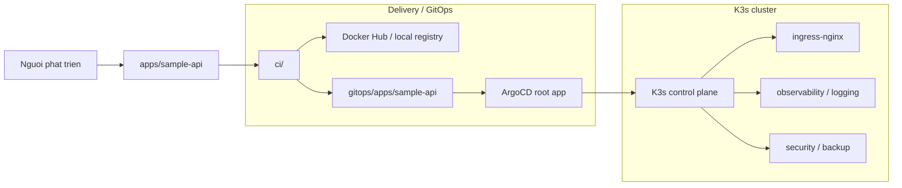
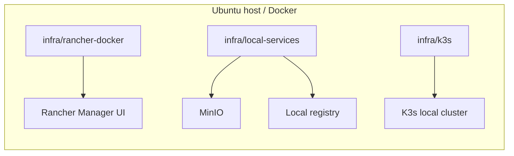
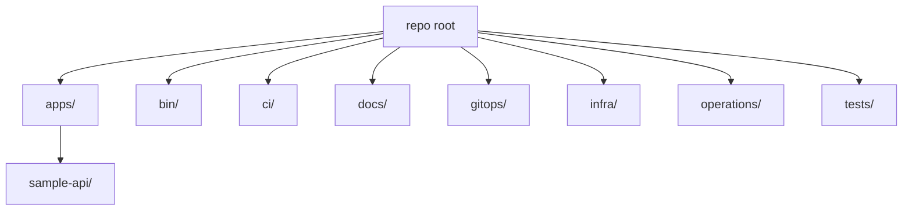
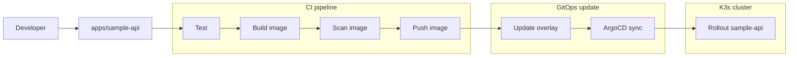
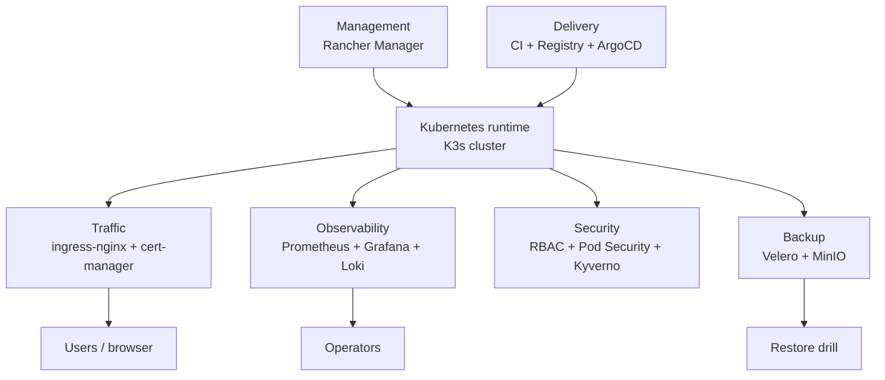

# Kien truc va module guide

Repo nay la template hoc DevOps/Kubernetes cho Rancher, K3s, ArgoCD va GitOps.
Tai lieu nay giai thich cac module trong repo theo cach de hieu, de bat dau hoc tu tu, va de biet file nao chiu trach nhiem gi.

Muc tieu chinh:

- hieu tong quan cach he thong hoat dong
- biet tung thu muc lam gi
- biet luong di tu source code den cluster
- biet bat dau doc tu dau neu moi hoc repo nay

## 1. So do tong quan

Moi truong local cung co phan rieng:

## 2. Cau truc thu muc chinh

Y nghia ngan gon:

- `apps/`: ung dung mau de hoc va demo
- `gitops/`: khai bao trang thai mong muon cua Kubernetes
- `infra/`: moi truong local va setup host
- `ci/`: pipeline build/test/scan/push
- `bin/`: script ho tro
- `docs/`: tai lieu hoc va mo ta kien truc
- `operations/`: checklist va runbook van hanh
- `tests/`: test bao ve cau hinh va hanh vi co ban

## 3. Bang module tong hop

| Module | Vai tro | File chinh | Lien ket chinh |
| --- | --- | --- | --- |
| `apps/sample-api/` | App Flask mau de test platform | `apps/sample-api/src/app.py`, `apps/sample-api/Dockerfile`, `apps/sample-api/tests/test_app.py` | `ci/`, `gitops/apps/sample-api/`, `tests/` |
| `gitops/` | Khai bao desired state cho cluster | `gitops/bootstrap/argocd/root-local.yaml`, `gitops/clusters/local/*`, `gitops/platform/*` | ArgoCD, K3s, app mau |
| `infra/` | Moi truong local cho lab | `infra/rancher-docker/`, `infra/local-services/`, `infra/k3s/` | Host, Rancher, registry, MinIO |
| `ci/` | Test/build/scan/push image va cap nhat GitOps | `ci/github/sample-api-ci.yaml`, `ci/gitlab/sample-api-ci.yml` | `apps/sample-api/`, `gitops/apps/sample-api/` |
| `bin/` | Lenh ho tro cho local workflow | `bin/check-host.sh`, `bin/render-gitops.sh`, `bin/build-local-sample-api.sh` | `Makefile`, `gitops/`, `apps/` |
| `docs/` | Tai lieu hoc theo tung phase | `docs/learning-path.md`, `docs/deployment-roadmap.md`, `docs/architecture.md` | Moi module trong repo |
| `operations/` | Checklist va runbook van hanh | `operations/checklists/platform-readiness.md`, `operations/runbooks/*` | `infra/`, `gitops/` |
| `tests/` | Regression test cho cau hinh repo | `tests/test_sample_api_image_registry.py` | `bin/`, `ci/`, `gitops/` |
| root `Makefile` | Shortcut cho cac lenh chinh | `Makefile` | `bin/`, `apps/sample-api/` |

## 4. Giai thich tung module

### 4.1 `apps/sample-api/`

Day la ung dung mau chinh cua repo. Muc dich cua no khong phai la phuc vu business, ma la de minh co mot workload nho, ro rang, de test toan bo platform.

Thanh phan chinh:

- [apps/sample-api/src/app.py](../apps/sample-api/src/app.py): ung dung Flask voi 3 endpoint
  - `/`: tra ve `service` va `status`
  - `/healthz`: dung cho liveness/readiness probe
  - `/metrics`: tra ve metrics mau cho Prometheus
- [apps/sample-api/Dockerfile](../apps/sample-api/Dockerfile): dong goi app thanh image Python 3.12 slim
- [apps/sample-api/requirements.txt](../apps/sample-api/requirements.txt): phu thuoc rat nho, chi co Flask va pytest
- [apps/sample-api/tests/test_app.py](../apps/sample-api/tests/test_app.py): test `/healthz`

Y nghia cua module nay:

- neu app chay duoc, ban biet container va service layer da dung co ban
- neu ingress hoat dong, ban truy cap duoc app qua host name
- neu metrics va log hoat dong, ban biet observability da ket noi

### 4.2 `gitops/`

Day la trung tam cua repo. Moi thu trong `gitops/` mo ta trang thai mong muon cua cluster bang Kubernetes manifests va Kustomize.

Co 3 lop chinh:

#### Bootstrap

- [gitops/bootstrap/argocd/install.md](../gitops/bootstrap/argocd/install.md) giai thich cach cai ArgoCD ban dau
- [gitops/bootstrap/argocd/root-local.yaml](../gitops/bootstrap/argocd/root-local.yaml) la root Application dau tien

Root app nay chi ve [gitops/clusters/local/](../gitops/clusters/local/) de ArgoCD co the quan ly tiep cac app con.

#### Cluster layer

- [gitops/clusters/local/kustomization.yaml](../gitops/clusters/local/kustomization.yaml) gom 2 phan: `platform.yaml` va `sample-api.yaml`
- [gitops/clusters/local/platform.yaml](../gitops/clusters/local/platform.yaml) trien khai cac component platform
- [gitops/clusters/local/sample-api.yaml](../gitops/clusters/local/sample-api.yaml) trien khai ung dung mau

Day la kieu "app-of-apps": cluster root chi biet cac app cap cao, con ArgoCD se tu sync cac resource ben trong.

#### Platform layer

[gitops/platform/kustomization.yaml](../gitops/platform/kustomization.yaml) gom cac module platform theo thu tu so:

- `00-namespaces`: tao namespace rieng, trong do `sample-api` co label Pod Security
- `10-ingress`: cai `ingress-nginx`
- `20-cert-manager`: cai `cert-manager`
- `30-observability`: cai `kube-prometheus-stack`
- `40-logging`: cai `loki` va `promtail`
- `50-secrets`: cai `sealed-secrets`
- `60-backup`: cai `velero`
- `70-registry`: ghi chu ve registry dung trong lab
- `80-policy`: cai `kyverno` va policy `require-run-as-non-root`

Cach chia so thu tu giup repo de doc va de debug. Ban co the them hoac bo tung lop ma khong can roi toan bo he thong.

#### App layer

[gitops/apps/sample-api/base/](../gitops/apps/sample-api/base/) mo ta app o muc Kubernetes co ban:

- Deployment: tao Pod chay container `sample-api`, cau hinh probe, resource va security context
- Service: tao ClusterIP de cac thanh phan trong cluster goi app qua port 80
- Ingress: expose app ra host `sample-api.local`
- ServiceMonitor: de Prometheus scrape endpoint `/metrics`
- NetworkPolicy: chi cho traffic tu namespace `ingress-nginx` vao app

[gitops/apps/sample-api/overlays/local/kustomization.yaml](../gitops/apps/sample-api/overlays/local/kustomization.yaml) la overlay cho local lab. Overlay nay doi image tu `localhost:5000/sample-api` sang `nghiadvbka/sample-api:local`.

Y nghia cua cach lam nay:

- base giu phan chung, khong phu thuoc moi truong
- overlay giu phan rieng cho local/dev
- CI co the update overlay ma khong phai sua manifest base

### 4.3 `infra/`

`infra/` chua cac huong dan de chuan bi moi truong chay lab.

Co 3 phan quan trong:

- [infra/rancher-docker/](../infra/rancher-docker/): chay Rancher Manager bang Docker cho lab/dev local
- [infra/local-services/](../infra/local-services/): chay MinIO va registry local bang Docker Compose
- [infra/k3s/](../infra/k3s/): cai K3s local va import cluster vao Rancher

Day la lop "nen tang" cua repo. Neu lop nay co van de, cac lop ben tren se kho debug hon rat nhieu.

### 4.4 `ci/`

`ci/` cho ban thay cung mot workflow co the trien khai tren nhieu CI provider.

Co 2 mau chinh:

- [ci/github/sample-api-ci.yaml](../ci/github/sample-api-ci.yaml)
- [ci/gitlab/sample-api-ci.yml](../ci/gitlab/sample-api-ci.yml)

Y tuong chung:

1. chay test cho app
2. build Docker image
3. scan image bang Trivy
4. push image len registry khi pipeline chay tren branch chinh hoac trong job build

Rieng GitHub Actions co them buoc `kustomize edit set image` de cap nhat overlay GitOps sau khi image moi da duoc build va push. GitLab CI trong repo hien la mau test/build/scan/push image, chua co buoc commit nguoc lai vao GitOps manifest.

### 4.5 `bin/`

`bin/` chua cac script nho de chay nhanh cac thao tac lap di lap lai.

Cac script chinh:

- [bin/check-host.sh](../bin/check-host.sh): kiem tra RAM, disk, tools, Docker, kubectl, context
- [bin/render-gitops.sh](../bin/render-gitops.sh): render Kustomize cua cluster/platform/sample-api ra file tam
- [bin/build-local-sample-api.sh](../bin/build-local-sample-api.sh): build va push image `sample-api`

Root [Makefile](../Makefile) bieu dien cac script nay thanh lenh ngan gon:

- `make check`
- `make render`
- `make test-sample`
- `make build-sample`

### 4.6 `docs/`

`docs/` giup nguoi hoc di theo tung buoc, khong bi choang.

Hai tai lieu nen doc dau tien:

- [docs/learning-path.md](learning-path.md): trinh tu hoc tu host readiness -> Rancher -> Kubernetes core -> GitOps -> observability -> CI/CD -> security/backup
- [docs/deployment-roadmap.md](deployment-roadmap.md): roadmap de len quy trinh trien khai

Tai lieu nay chinh la mot "ban do hoc". Neu ban moi bat dau, day la noi nen mo truoc.

### 4.7 `operations/`

`operations/` chua cac tai lieu de van hanh va kiem tra moi truong.

- [operations/checklists/platform-readiness.md](../operations/checklists/platform-readiness.md): checklist truoc khi cai dat
- [operations/runbooks/](../operations/runbooks/): runbook cho cac tinh huong van hanh

Thu muc nay huu ich khi ban khong con chi hoc, ma da bat dau lam lab hoac rollback/restore.

### 4.8 `tests/`

`tests/` khong test app theo nghia thong thuong, ma test su dong bo giua cac file cau hinh quan trong.

[tests/test_sample_api_image_registry.py](../tests/test_sample_api_image_registry.py) kiem tra 3 dieu:

- overlay local co rewrite image sang Docker Hub
- build script mac dinh push dung image name
- GitHub Actions dung Docker Hub image va login dung secret

Day la mot kieu regression test rat huu ich cho repo GitOps, vi nhieu loi khong nam trong code Python, ma nam trong manifest, script, hoac workflow.

## 5. Luong CI/CD va GitOps

So do luong trien khai:

Trong repo hien tai, GitHub Actions the hien gan du luong nay. GitLab CI la mau de test/build/scan/push image va co the mo rong them buoc update GitOps neu can.

## 6. Cac layer trong cluster

Ngoai cach nhin theo thu muc, co the nhin repo theo cac layer chuc nang.

### Management layer

- Rancher Manager chay bang Docker container
- Rancher quan ly Kubernetes cluster qua agent
- Nguoi hoc dung Rancher UI de quan sat cluster, workload, namespace, RBAC, log va event

Vai tro: cung cap UI quan ly cluster va giup nguoi moi de nhin thay ben trong Kubernetes hon.

### Kubernetes runtime layer

- K3s local cluster la noi chay platform components va application workloads
- Traefik mac dinh co the tat khi dung `ingress-nginx`
- Kubernetes API la diem ArgoCD va cac tool tuong tac voi cluster

Vai tro: la runtime chinh cua toan bo lab.

### Delivery layer

- CI nam trong `ci/`
- Registry co the la Docker Hub, GHCR hoac registry local
- ArgoCD sync desired state tu `gitops/` vao cluster

Vai tro: dua thay doi tu Git vao Kubernetes theo cach co kiem soat.

### Traffic layer

- `ingress-nginx` nhan request tu ben ngoai cluster
- `cert-manager` phu trach certificate/TLS khi co cau hinh issuer phu hop
- Ingress cua `sample-api` route host `sample-api.local` vao Service cua app

Vai tro: expose app va platform UI ra host/domain de truy cap.

### Observability layer

- `kube-prometheus-stack` gom Prometheus, Grafana va Alertmanager
- `ServiceMonitor` cua `sample-api` giup Prometheus scrape `/metrics`
- `loki` luu log
- `promtail` thu log tu node/pod va day ve Loki

Vai tro: giup xem metrics, log, dashboard, alert va tinh trang rollout.

### Security layer

- Namespace `sample-api` co Pod Security label muc `restricted`
- Deployment cua `sample-api` chay non-root va drop Linux capabilities
- NetworkPolicy chi cho traffic tu `ingress-nginx` vao app
- Kyverno co policy `require-run-as-non-root` o che do audit
- Sealed Secrets la huong de khong commit secret dang plain text

Vai tro: tao cac hang rao an toan co ban cho lab.

### Backup layer

- MinIO local co the dong vai tro S3-compatible storage
- Velero backup Kubernetes resources va co the dung cho restore drill
- Rancher Docker volume can duoc bao ve rieng neu muon giu cau hinh Rancher

Vai tro: giam rui ro mat cau hinh lab va giup hoc quy trinh backup/restore.

## 7. Luong hoat dong chinh khi dung repo

Day la cach cac module noi voi nhau trong thuc te:

1. Nguoi hoc kiem tra host bang `make check` hoac `bin/check-host.sh`
2. Chay Rancher va local services tu `infra/`
3. Cai K3s va import cluster vao Rancher
4. Cai ArgoCD va apply root app
5. ArgoCD sync [gitops/platform/](../gitops/platform/) va [gitops/apps/sample-api/](../gitops/apps/sample-api/)
6. `sample-api` chay trong namespace rieng, co Service, Ingress, metrics va NetworkPolicy
7. CI test/build/scan image, sau do cap nhat overlay GitOps neu pipeline co buoc nay
8. Observability theo doi app, backup luu trang thai, policy giu an toan co ban

## 8. Cach hoc repo nay theo thu tu de de hieu

Neu ban la nguoi moi, minh de xuat thu tu:

1. [docs/learning-path.md](learning-path.md)
2. [infra/rancher-docker/README.md](../infra/rancher-docker/README.md)
3. [infra/k3s/README.md](../infra/k3s/README.md)
4. [apps/sample-api/src/app.py](../apps/sample-api/src/app.py)
5. [gitops/bootstrap/argocd/install.md](../gitops/bootstrap/argocd/install.md)
6. [gitops/clusters/local/kustomization.yaml](../gitops/clusters/local/kustomization.yaml)
7. [gitops/platform/kustomization.yaml](../gitops/platform/kustomization.yaml)
8. [gitops/apps/sample-api/base/](../gitops/apps/sample-api/base/)
9. [ci/github/sample-api-ci.yaml](../ci/github/sample-api-ci.yaml)
10. [tests/test_sample_api_image_registry.py](../tests/test_sample_api_image_registry.py)

## 9. Tom tat

Co the hieu repo nay theo 4 lop:

- **App lop**: `apps/sample-api/`
- **GitOps lop**: `gitops/`
- **Infra lop**: `infra/`
- **Automation va hoc tap**: `ci/`, `bin/`, `docs/`, `operations/`, `tests/`

Neu ban hieu duoc 4 lop nay, ban se de dang nam bat duoc toan bo template.
